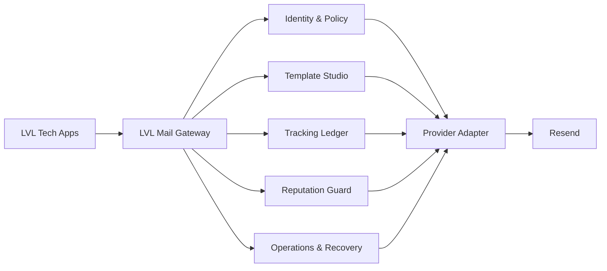

<div align="center">

# LVL Mail

**Central transactional email infrastructure for LVL Tech products.**

One gateway for delivery, templates, tracking, reputation, recovery and operational control — without coupling each application directly to an email provider.

[](https://github.com/tec-2022/LVL-Mail/actions/workflows/ci.yml)


`mail.lvltechmx.com`

</div>

---

## What is LVL Mail?

LVL Mail is the **email control plane for LVL Tech**. Applications such as NexMesa, FINLAB, Cody and future products integrate with one internal API instead of managing provider credentials, templates, retries, reputation and tracking independently.

The platform is designed around one core rule:

> **Critical email must stay fast, traceable and isolated from mistakes made by another application.**



## Why it exists

A shared provider account is simple at first, but it creates platform-level risks as more products start sending email. LVL Mail centralizes that complexity while keeping **application-level isolation**.

- One application cannot choose its own delivery priority.
- Authentication email gets reserved P0 capacity.
- Every valid send receives a tracking ID before the provider is contacted.
- API credentials are isolated per application and stored only as hashes.
- Templates are versioned and centrally governed.
- Bounce and complaint behavior is observed per application.
- Safe Replay never reuses authentication credentials.
- Staff access is invite-only, role-based and optionally scoped to specific applications.
- Provider-specific behavior stays behind an adapter instead of leaking into product code.

## Platform capabilities

### Application onboarding

Adding a product is intentionally lightweight. The control plane can create an application from its URL and provision:

- application identity;
- sender identity under `mail.lvltechmx.com`;
- one-time gateway API key;
- default transactional template catalog;
- priority and quota policy;
- mandatory tracking;
- integration contract.

### Priority engine

Priority is decided by LVL Mail, never by the caller.

| Priority | Purpose | Examples |
|---|---|---|
| **P0** | Security & access | Email verification, password reset, OTP |
| **P1** | Transactional | Orders, invoices, reservations, invitations |
| **P2** | Notifications | Reports, alerts, summaries |
| **P3** | Marketing | Disabled until consent/unsubscribe controls are complete |

P0 traffic has reserved capacity and bypasses batching behavior intended for lower-priority traffic.

### Template Studio

Each application has a structured email design system with:

- Draft → Published → Archived lifecycle;
- desktop and mobile preview;
- version history;
- server-owned variable contracts;
- protected critical CTA/OTP structure;
- test send;
- publish and rollback;
- exact template-version attribution for every message.

Applications never submit arbitrary HTML into the delivery pipeline.

### Mandatory per-application tracking

Every valid send intent is written to the mail ledger **before** the provider call.

Tracked metadata includes:

- application;
- template and exact version;
- priority;
- provider and provider message ID;
- lifecycle status;
- failure code;
- timestamps;
- idempotency key;
- replay ancestry;
- SHA-256 recipient hash for ordinary observability.

Signed provider webhooks reconcile delivery events back to the same message and application.

### Reputation protection

LVL Mail treats shared-domain reputation as a platform resource.

Per-application controls include:

- minute and daily quotas;
- P0 reserved capacity;
- circuit breaker;
- bounce/complaint monitoring;
- suppression enforcement;
- Live / Test / Paused mode;
- independent API key rotation and revocation;
- audit history.

A noisy product can be restricted without shutting down authentication email for the rest of the platform.

### Operations & Reliability

The operations center provides application-level delivery health and incident handling.

Signals include:

- P0 acceptance latency P50/P95/P99;
- P0 delivery latency P50/P95/P99;
- P0 delivery rate;
- provider rejection rate;
- bounce rate;
- complaint rate;
- fleet health by application;
- persistent warning/critical incidents;
- Open → Acknowledged → Resolved incident lifecycle;
- actor-attributed incident timeline.

### Search & Recovery

The operational workbench can search by:

- tracking ID;
- provider ID;
- idempotency key;
- application;
- template and version;
- message state;
- provider;
- date range;
- exact recipient through server-side hashing.

Recipient addresses are not placed in search URLs or stored in clear text in the ordinary tracking ledger.

#### Safe Replay

Replay is deliberately conservative.

**Never replayed:**

- email verification;
- password reset;
- OTP;
- P0 messages;
- accepted/sent/delayed/delivered messages;
- bounced/complained/suppressed messages;
- ambiguous provider transport outcomes.

Approved non-critical messages that failed definitively may use a short-lived AES-256-GCM recovery envelope. A replay receives a new tracking ID, preserves the original failure and re-runs suppression, reputation, quota and template checks.

One source message can produce at most one Safe Replay.

## Identity & Access Management

LVL Mail uses Supabase Auth for staff identity and server-side membership for authorization.

| Role | Access |
|---|---|
| **Owner** | Full platform, team and security control |
| **Admin** | Applications, templates, keys and operations |
| **Operator** | Operational investigation, incidents, test sends and Safe Replay |
| **Viewer** | Read-only operational access |

Owner/Admin remain global. Operator/Viewer can be either global or explicitly scoped to selected applications.

Authorization does not trust client-supplied roles or `user_metadata`. Membership state is resolved server-side so disabling a user, changing a role or changing app scopes takes effect on the next privileged request.

The final active Owner is protected from accidental demotion or disablement.

## Provider abstraction

Product applications integrate with LVL Mail — not directly with Resend.

```text
Application
    │
    ▼
POST /api/v1/send
    │
    ▼
LVL Mail policy + tracking + template + reputation
    │
    ▼
Provider adapter
    │
    ▼
Resend
```

The provider layer supports primary/secondary topology. Automatic cross-provider failover is intentionally avoided for ambiguous transport outcomes because the first provider may already have accepted the message.

## Sending API

`POST /api/v1/send`

```http
Content-Type: application/json
x-lvl-mail-key: <application-gateway-key>
```

```json
{
  "appId": "my-product",
  "template": "verify-email",
  "to": "user@example.com",
  "idempotencyKey": "verify-user-0192ac",
  "variables": {
    "name": "Alex",
    "confirmationUrl": "https://myproduct.com/auth/confirm?token=...",
    "expiresMinutes": "15"
  }
}
```

The application key authenticates the calling product. Template, priority and policy remain server-owned.

## Technology

- **Next.js 16** — control plane and server routes
- **TypeScript** — application code
- **React 19** — operator interface
- **Supabase / PostgreSQL** — persistence, Auth and operational data
- **Resend** — current delivery provider behind the adapter layer
- **GitHub Actions** — CI

## Local development

Requirements: Node.js 22+.

```bash
git clone https://github.com/tec-2022/LVL-Mail.git
cd LVL-Mail
npm ci
cp .env.example .env.local
npm run dev
```

Open `http://localhost:3000`.

Useful commands:

```bash
npm run lint
npm run build
```

## Configuration

Core environment contract:

```env
LVL_MAIL_PRIMARY_PROVIDER=resend
LVL_MAIL_SECONDARY_PROVIDER=
LVL_MAIL_FAILOVER_MODE=disabled
LVL_MAIL_SENDING_DOMAIN=mail.lvltechmx.com

RESEND_API_KEY=re_xxxxxxxxx
RESEND_WEBHOOK_SECRET=whsec_xxxxxxxxx

NEXT_PUBLIC_SUPABASE_URL=https://your-project.supabase.co
NEXT_PUBLIC_SUPABASE_PUBLISHABLE_KEY=sb_publishable_xxxxxxxxx
SUPABASE_URL=https://your-project.supabase.co
SUPABASE_SERVICE_ROLE_KEY=replace-me

LVL_MAIL_RECOVERY_KEY=replace-with-32-byte-base64-key
LVL_MAIL_CRON_SECRET=replace-with-an-independent-long-random-secret

LVL_MAIL_BREAK_GLASS_ENABLED=true
LVL_MAIL_ADMIN_USER=admin
LVL_MAIL_ADMIN_PASSWORD=replace-with-a-long-random-password
```

`SUPABASE_SERVICE_ROLE_KEY`, provider credentials, recovery keys, scheduler secrets and break-glass credentials are strictly server-side.

## Control plane

| Route | Purpose |
|---|---|
| `/` | Platform status and priority overview |
| `/apps` | Application fleet |
| `/apps/new` | URL-first onboarding |
| `/apps/[appId]` | Application control center |
| `/templates` | Template Studio |
| `/activity` | Search & Recovery |
| `/reputation` | Deliverability health |
| `/operations` | SLOs and incidents |
| `/team` | Staff, roles and application scopes |
| `/settings` | Infrastructure/security state |

## Security model

Core invariants:

- provider secrets never reach product applications;
- application gateway secrets are stored only as hashes;
- staff registration is invite-only;
- identity and authorization are separate concerns;
- `service_role` never reaches browser code;
- critical priorities are server-owned;
- arbitrary application HTML is rejected by design;
- critical CTA URLs require HTTPS;
- idempotency is mandatory;
- tracking is mandatory;
- clear recipient addresses are avoided in the ordinary ledger;
- recovery payloads are encrypted and short-lived;
- P0 credentials are never replayed;
- webhook signatures are verified before reconciliation;
- marketing remains disabled until dedicated consent and unsubscribe controls exist.

More detail: [`docs/IAM-DESIGN.md`](docs/IAM-DESIGN.md).

## Repository status

> **Pre-production infrastructure.**

The control plane, policy model, tracking architecture, Template Studio, reliability engine, recovery workflow and IAM model are implemented in code. Production infrastructure is intentionally not connected yet.

Still required before live traffic:

1. select the dedicated Supabase project;
2. apply reviewed migrations;
3. configure production Auth and bootstrap the first Owner;
4. validate scoped RBAC and audit behavior;
5. verify `mail.lvltechmx.com` with SPF/DKIM/DMARC;
6. configure signed provider webhooks;
7. deploy the control plane over HTTPS;
8. configure reliability scheduling and alerting;
9. connect one LVL Tech application first and validate P0 end-to-end;
10. complete production-readiness checks before expanding traffic.

## Design philosophy

LVL Mail is not intended to become a generic bulk-email platform.

It exists to provide **safe, observable and consistent transactional email infrastructure** for products operated by LVL Tech — with authentication email treated as critical infrastructure rather than an afterthought.

---

<div align="center">

**LVL Tech · Email Infrastructure**  
`mail.lvltechmx.com`

</div>
